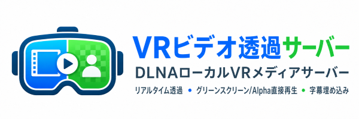
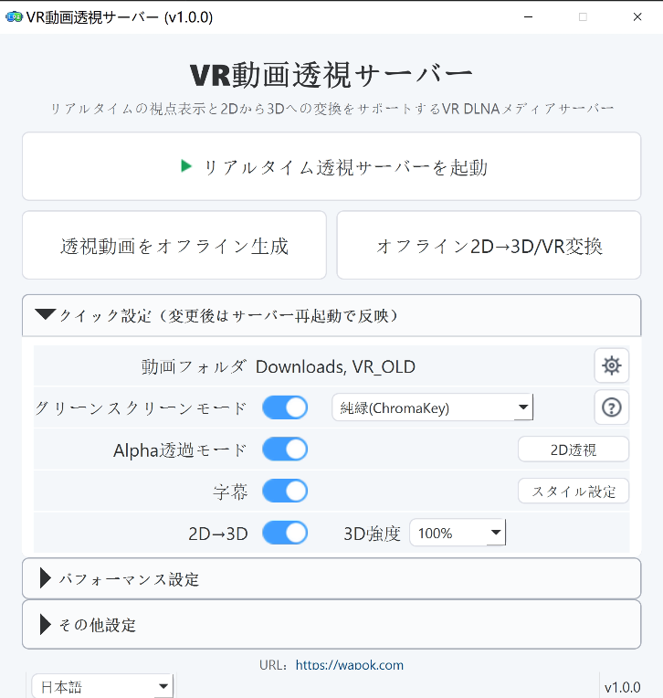

# VR Video Passthrough Server

日本語 | [English](README.md) | [中文](README.zh-CN.md)

公式サイト：[https://wapok.com](https://wapok.com)

VR Video Passthrough Server の目標は、すべてのVR動画をパススルー対応にし、複合現実（MR）を実現することです。



これは Windows を主な実行環境とする VR DLNA ローカルメディアサーバーで、デスクトップ操作とオフライン生成ワークフローに対応しています。DLNA/UPnP 経由でローカル動画ライブラリを公開し、リアルタイムのパススルーストリーム出力をサポートします。グリーンスクリーン合成と Alpha パススルーを切り替えられ、リアルタイム字幕埋め込みにも対応しています。さらに、リアルタイム/オフラインの 2D→3D / VR 生成、任意の深度安定化、同名 `.si.wav` サイドカーによる同時通訳再生にも対応しています。VR Video Passthrough Server は主に VR180 half-equirectangular 動画ソース向けに設計されています。

## プロジェクトの起源

当初ただVR動画の透視ツールを作りたかった。  
誰かに「車輪の再発明だ」と言われたので、こう返しました。  
「あの何年も前の古い車輪はもう古すぎる。新しいものが必要だ」と。  
7日後、新しい車輪が誕生した。  
これこそ、AI時代の奇跡である。   

## 機能

- DLNA 検出と ContentDirectory ブラウズ
- GPU マッティングと HEVC 出力によるリアルタイムパススルーストリーミング
- パススルーストリームへのリアルタイム字幕埋め込み
- グリーンスクリーンモードと Alpha パススルーモード
- オフラインパススルー動画生成
- DA3 深度と GPU ステレオレンダリングによる、平面 2D 動画のリアルタイム/オフライン 2D→3D / VR 生成
- 内蔵の時間方向安定化と、オフライン 16:9 ジョブ向け NVDS ONNX 安定化を含む、任意の 2D→3D 深度安定化
- 同名 `.si.wav` サイドカーと `[SI]` DLNA エントリによる同時通訳再生
- 10 分単位のグループ、分単位フォルダー、5 秒単位の再生ポイントで開始時刻を選べる DLNA Live 時間インデックス
- 複数のローカル動画ルートディレクトリに対応
- 中国語、英語、日本語に対応した PySide6 デスクトップ UI
- 字幕プレビューと字幕スタイル設定
- ハードウェアが維持できる範囲で 8K クラスのソース再生を目指す、VRAM を意識した積極的なパイプライン調整


|  |


## パススルー出力例

| Alpha Passthrough | グリーンスクリーン Passthrough |
| --- | --- |
|  |  |
|  |

## 動作要件

- Windows 10 / 11
- Python 3.12
- リアルタイムパイプライン用の NVIDIA GPU。目安として RTX 20 シリーズ以上を推奨します。正確な型番は NVIDIA 公式リストを確認してください: <https://developer.nvidia.com/cuda/gpus>。推奨 VRAM: リアルタイムサーバー、RVM オフライン生成、通常の DA3 2D→3D は 6 GB 以上、MatAnyone2 / SAM3 オフラインワークフローは約 15 GB 以上。HD/Large DA3 と NVDS 時間方向安定化は主にオフライン向けで、より多くの VRAM が必要になる場合があります。NVDS は 16 GB 以上の GPU を想定しています。
- FFmpeg / FFprobe

## クイックスタート

```bash
uv run python main.py
```

デスクトップ UI を起動:

```bash
uv run python -m ui.app
```

## ポートとファイアウォール

リアルタイムサーバーを起動すると、次のネットワークポートを使用します。

| 用途 | プロトコル / ポート | 説明 |
| --- | --- | --- |
| HTTP メディアサービス | TCP 8200 | DLNA デバイス記述、メディアカタログ、サムネイル、元動画、リアルタイム passthrough ストリームを提供します。`PT_HTTP_PORT` で変更できます。 |
| SSDP / UPnP 検出 | UDP 1900 | LAN 内の VR プレイヤーがこの DLNA サーバーを検出するために使用します。 |
| 起動ステータス | TCP 8299（ローカルホストのみ） | デスクトップ UI が GPU warmup / 起動状態を読むために使用します。デフォルトではローカル UI 用です。`PT_STARTUP_STATUS_PORT` で変更できます。 |

初回起動時、アプリケーションは次の Windows ファイアウォール受信規則を自動追加しようとします。

- `PTServer HTTP Private`: プライベートネットワーク上の TCP 8200 受信を許可します。
- `PTServer SSDP Private`: プライベートネットワーク上の UDP 1900 受信を許可します。

Windows が UAC / ファイアウォール確認を表示した場合は、許可してください。通常の家庭内 LAN 利用では「プライベートネットワーク」のみ許可し、パブリックネットワークには公開しないことを推奨します。

誤って拒否した場合、または VR プレイヤーがサーバーを検出できない場合は、手動で規則を追加できます。PowerShell またはコマンドプロンプトを管理者として開き、次を実行してください。

```powershell
netsh advfirewall firewall add rule name="PTServer HTTP Private" dir=in action=allow protocol=TCP localport=8200 profile=private edge=no enable=yes
netsh advfirewall firewall add rule name="PTServer SSDP Private" dir=in action=allow protocol=UDP localport=1900 profile=private edge=no enable=yes
```

`PT_HTTP_PORT` を変更した場合は、1 行目の `8200` を実際のポートに置き換えてください。UDP 1900 は UPnP/SSDP の標準検出ポートなので、通常は変更不要です。

Windows の GUI から設定することもできます。

1. 「Windows セキュリティ」 -> 「ファイアウォールとネットワーク保護」 -> 「詳細設定」を開きます。
2. 「受信の規則」に入り、新しい規則を作成します。
3. 規則の種類は「ポート」を選択します。
4. `TCP 8200` と `UDP 1900` を別々の規則として追加します。
5. 操作は「接続を許可する」を選択します。
6. 可能であればプロファイルは「プライベート」のみ選択します。
7. 規則名は `PTServer HTTP Private` と `PTServer SSDP Private` にします。

## 対応 VR 動画プレイヤー

Meta Quest 3 でテストしています。

| プレイヤー | Alpha パススルー | グレーグリーンスクリーン | ChromaKey グリーンスクリーン | Web サイト | 備考 |
| --- | --- | --- | --- | --- | --- |
| Skybox VR Player 2.0.2 Preview | 対応 | - | 対応 | [公式サイト](https://skybox.xyz) | [インストール説明](https://forum.skybox.xyz/d/2920-skybox-quest-v202-preview-performance-improvements) |
| Moon Player | - | 対応 | 対応 | [公式サイト](https://moonvrplayer.com) | - |
| 4XVR Video Player | 対応 | - | 対応 | [公式サイト](https://www.4xvr.net/) | - |
| DeoVR player | 対応 | - | 対応 | [公式サイト](https://deovr.com/) | - |
| HereSphere VR Video Player | 対応 | - | 対応 | [公式サイト](https://heresphere.com/) | - |

## 設定メモ

- `PT_VIDEO_DIR` は `|` 区切りで複数のルートディレクトリを指定できます
- `PT_PASSTHROUGH_OUTPUT_MODE` は `none`、`green`、`alpha`、`two_dvr`、`green,alpha,two_dvr` のようなカンマ区切りの組み合わせ、旧互換の green + alpha 用 `all` に対応しています
- Alpha モードでは DLNA 仮想アイテムのタイトルとして `Alpha Passthrough` が使われます
- リアルタイム 2D→3D は `PT_TWO_DVR_MODEL`、`PT_TWO_DVR_STRENGTH`、関連する `PT_TWO_DVR_*` 設定を使用します。オフライン 2D→3D / VR は、デスクトップ UI からモデル、品質/速度、時間方向安定化、既存ターゲットのスキップを設定できます。
- 同名 `.si.wav` ファイルがあると、progressive virtual MP4 の `/media_si` ルート経由で `[SI]` DLNA エントリが有効になります。主なスイッチは `PT_SI_MIX_ENABLED`、`PT_SI_PROGRESSIVE_ENABLED`、`PT_SI_PROGRESSIVE_DLNA` です。
- DLNA Live ディレクトリでは、パススルーモードに `[GREEN]` / `[ALPHA]` 接頭辞が付き、開始時刻選択用のローカライズされた `[時間インデックス選択]` フォルダーが表示されます。
- TensorRT アクセラレーションはデスクトップ UI の Performance パネルから制御します。まず `TensorRT -> Configure` でキャッシュを構築してください。初回構築には数分かかる場合があります。ドライバー、CUDA、TensorRT、モデルの変更でキャッシュが欠落または古くなった場合、サーバーは自動的に CUDA にフォールバックします。
- UI 設定はバックエンドのランタイム設定とは別に保存されます

## プロジェクト構成

```text
main.py        サーバーのエントリポイント
config.py      ランタイム設定
dlna/          UPnP / DLNA 検出とカタログ
http_app/      FastAPI ルート
pipeline/      デコード、マッティング、エンコード、サムネイル、字幕パイプライン
offline/       本番向けオフライン変換エントリポイント
ui/            PySide6 デスクトップ UI、ページ、i18n、プロセス制御
tools/         開発用プローブと診断ツール
models/        ローカルモデルファイルとマニフェスト
resources/     パッケージ用 UI / ランタイムアセット
prompt/        引き継ぎメモと調査レポート
```

## 参照しているオープンソースモデル

VR Video Passthrough Server 自体はマッティングモデルを学習しません。以下の上流プロジェクトが提供するモデルとモデルファイルを使用します。

| モデル | 役割 | 上流 |
| --- | --- | --- |
| Robust Video Matting (RVM) | `rvm_mobilenetv3_fp32.onnx` と `rvm_resnet50_fp32.onnx` を含む、主要なリアルタイムマッティング経路 | [GitHub](https://github.com/PeterL1n/RobustVideoMatting) |
| MatAnyone2 | オフライン変換と実験的ワークフローで使う、低速だが通常は高品質なマッティング経路 | [GitHub](https://github.com/pq-yang/MatAnyone2) |
| Segment Anything Model 3 (SAM 3) | 実験的な Alpha ツールと前処理ワークフローで使う任意の補助モデル | [GitHub](https://github.com/facebookresearch/sam3) |
| Depth Anything 3 (DA3) | リアルタイム/オフライン 2D→3D / VR 生成で使う単眼深度モデル | [GitHub](https://github.com/ByteDance-Seed/Depth-Anything-3) |
| NVDS | 16:9 ソース向けの任意のオフライン 2D→3D 深度 / near-map 時間方向安定化モデル | [GitHub](https://github.com/RaymondWang987/NVDS) |

## 参照している依存関係

- [PySide6](https://www.qt.io/qt-for-python)
- [FastAPI](https://github.com/fastapi/fastapi)
- [Uvicorn](https://github.com/encode/uvicorn)
- [ONNX Runtime](https://github.com/microsoft/onnxruntime)
- [CuPy](https://github.com/cupy/cupy)
- [PyNvVideoCodec](https://github.com/NVIDIA/VideoProcessingFramework)
- [PyAV](https://github.com/PyAV-Org/PyAV)

## 注意事項

- このコードベースは、ホスト型サービスとしてのデプロイではなく、ローカル Windows マシンでの利用を主に想定しています。
- Alpha パススルーは `VR Passthrough Server` という DLNA 仮想アイテムとして表示されます。
- 現在のパイプラインは、汎用的な 360 度動画や平面動画ではなく、VR180 half-equirectangular ソース向けに調整されています。
- 英語版は [README.md](README.md)、中国語版は [README.zh-CN.md](README.zh-CN.md) を参照してください。

## ライセンス

ライセンス: `AGPL-3.0-or-later`

プロジェクトのライセンス条件は、リポジトリのライセンスファイルを参照してください。上流モデルのリポジトリには、それぞれ独自のライセンスと利用条件があります。
