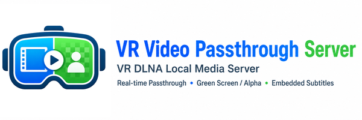
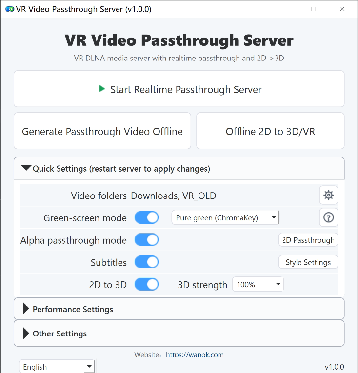

# VR Video Passthrough Server

English | [中文](README.zh-CN.md) | [日本語](README.ja-JP.md)

Website: [https://wapok.com](https://wapok.com)

VR Video Passthrough Server aims to make every VR video passthrough-capable, enabling mixed reality (MR).



It is a Windows-first VR DLNA local media server for desktop control and offline generation workflows. It exposes a local video library over DLNA/UPnP and supports realtime passthrough stream output, with switching between green-screen compositing and Alpha passthrough, as well as realtime subtitle embedding. It also includes realtime/offline 2D-to-3D / VR generation, optional depth stabilization, and simultaneous-interpretation playback from same-stem `.si.wav` sidecars. VR Video Passthrough Server is primarily designed for VR180 half-equirectangular video sources.

## Project Origin

I originally wanted to build a VR video passthrough tool.   
Someone said: "You’re just reinventing the wheel."  
I replied: "That old wheel from years ago is too outdated. It's time for a new one."  
Seven days later, the new wheel was born.    
This is the miracle of the AI era.    

## Features

- DLNA discovery and ContentDirectory browsing
- Realtime passthrough streaming with GPU matting and HEVC output
- Realtime subtitle embedding in the passthrough stream
- Green-screen and alpha passthrough modes
- Offline passthrough video generation
- Realtime and offline 2D-to-3D / VR generation for flat 2D videos using DA3 depth and GPU stereo rendering
- Optional 2D-to-3D depth stabilization, including built-in temporal stabilization and NVDS ONNX stabilization for offline 16:9 jobs
- Simultaneous interpretation playback with same-stem `.si.wav` sidecars and `[SI]` DLNA entries
- DLNA Live time-index folders for choosing a playback start time, with 10-minute groups, minute folders, and 5-second playback points
- Multi-root local video library support
- PySide6 desktop UI with Chinese, English, and Japanese translations
- Subtitle preview and style configuration
- Aggressive VRAM-aware pipeline tuning aimed at keeping realtime output smooth, including 8K-class source playback targets where the hardware can sustain them


|  |


## Passthrough Output Examples

| Alpha Passthrough | Green-screen Passthrough |
| --- | --- |
|  |  |
|  |


## Requirements

- Windows 10 / 11
- Python 3.12
- NVIDIA GPU for the realtime pipeline. Rough recommendation: RTX 20 series or newer. Check your exact model on NVIDIA's official list: <https://developer.nvidia.com/cuda/gpus>. Recommended VRAM: 6 GB or more for the realtime server, RVM offline generation, and normal DA3 2D-to-3D; about 15 GB or more for MatAnyone2 / SAM3 offline workflows. HD/Large DA3 and NVDS temporal stabilization are offline-oriented and can require significantly more VRAM; NVDS is intended for 16 GB+ cards.
- FFmpeg / FFprobe

## Quick Start

```bash
uv run python main.py
```

Launch the desktop UI:

```bash
uv run python -m ui.app
```

## Ports and Firewall

When the realtime server starts, it uses the following network ports:

| Purpose | Protocol / Port | Description |
| --- | --- | --- |
| HTTP media service | TCP 8200 | Serves the DLNA device description, media catalog, thumbnails, source videos, and realtime passthrough streams. You can change it with `PT_HTTP_PORT`. |
| SSDP / UPnP discovery | UDP 1900 | Lets VR players discover the local DLNA server on your LAN. |
| Startup status | TCP 8299 (localhost only) | Used by the desktop UI to read GPU warmup / startup status. It is intended for local UI use only by default. You can change it with `PT_STARTUP_STATUS_PORT`. |

On first startup, the application tries to add these Windows Firewall inbound rules automatically:

- `PTServer HTTP Private`: allows inbound TCP 8200 on private networks.
- `PTServer SSDP Private`: allows inbound UDP 1900 on private networks.

If Windows shows a UAC / firewall confirmation prompt, allow it. For normal home LAN usage, allow private networks only; do not expose the server on public networks.

If you accidentally denied the prompt, or if your VR player cannot discover the server, add the rules manually. Open PowerShell or Command Prompt as Administrator and run:

```powershell
netsh advfirewall firewall add rule name="PTServer HTTP Private" dir=in action=allow protocol=TCP localport=8200 profile=private edge=no enable=yes
netsh advfirewall firewall add rule name="PTServer SSDP Private" dir=in action=allow protocol=UDP localport=1900 profile=private edge=no enable=yes
```

If you changed `PT_HTTP_PORT`, replace `8200` in the first command with your actual port. UDP 1900 is the standard UPnP/SSDP discovery port and normally should not be changed.

You can also configure this from the Windows UI:

1. Open "Windows Security" -> "Firewall & network protection" -> "Advanced settings".
2. Go to "Inbound Rules" and create a new rule.
3. Choose "Port" as the rule type.
4. Add `TCP 8200` and `UDP 1900` as separate rules.
5. Choose "Allow the connection".
6. Select the "Private" profile only when possible.
7. Name the rules `PTServer HTTP Private` and `PTServer SSDP Private`.

## Supported VR Players

Tested on Meta Quest 3.

| Player | Alpha passthrough | Gray green screen | ChromaKey green screen | Website | Notes |
| --- | --- | --- | --- | --- | --- |
| Skybox VR Player 2.0.2 Preview | Supported | - | Supported | [Official site](https://skybox.xyz) | [Installation notes](https://forum.skybox.xyz/d/2920-skybox-quest-v202-preview-performance-improvements) |
| Moon Player | - | Supported | Supported | [Official site](https://moonvrplayer.com) | - |
| 4XVR Video Player | Supported | - | Supported | [Official site](https://www.4xvr.net/) | - |
| DeoVR player | Supported | - | Supported | [Official site](https://deovr.com/) | - |
| HereSphere VR Video Player | Supported | - | Supported | [Official site](https://heresphere.com/) | - |

## Configuration Notes

- `PT_VIDEO_DIR` supports multiple roots separated by `|`
- `PT_PASSTHROUGH_OUTPUT_MODE` supports `none`, `green`, `alpha`, `two_dvr`, comma-separated combinations such as `green,alpha,two_dvr`, and legacy `all` for green + alpha
- `Alpha Passthrough` is the DLNA virtual title used in alpha mode
- Realtime 2D-to-3D uses `PT_TWO_DVR_MODEL`, `PT_TWO_DVR_STRENGTH`, and related `PT_TWO_DVR_*` settings; offline 2D-to-3D / VR exposes model, quality-speed, temporal stability, and skip-existing controls in the desktop UI.
- Same-stem `.si.wav` files enable `[SI]` DLNA entries through the progressive virtual MP4 `/media_si` route. The main switches are `PT_SI_MIX_ENABLED`, `PT_SI_PROGRESSIVE_ENABLED`, and `PT_SI_PROGRESSIVE_DLNA`.
- DLNA Live directories use `[GREEN]` / `[ALPHA]` prefixes for passthrough modes and include a localized `[Select Time Index]` folder for start-time selection.
- TensorRT acceleration is controlled from the desktop UI Performance panel. Build the cache first in `TensorRT -> Configure`; the first build can take several minutes. If the cache is missing or stale after a driver/CUDA/TensorRT/model change, the server falls back to CUDA automatically.
- UI settings are stored separately from backend runtime configuration

## Project Layout

```text
main.py        Server entry point
config.py      Runtime configuration
dlna/          UPnP / DLNA discovery and catalog
http_app/      FastAPI routes
pipeline/      Decode, matting, encode, thumbnail, subtitle pipeline
offline/       Production offline conversion entry points
ui/            PySide6 desktop UI, pages, i18n, and process control
tools/         Developer probes and diagnostics
models/        Local model files and manifests
resources/     Packaged UI/runtime assets
prompt/        Handover notes and investigation reports
```

## Referenced Open Source Models

VR Video Passthrough Server does not train matting models itself. It consumes upstream models and model files from the projects below.

| Model | Role | Upstream |
| --- | --- | --- |
| Robust Video Matting (RVM) | Primary realtime matting path, including `rvm_mobilenetv3_fp16.onnx`, `rvm_mobilenetv3_fp32.onnx`, and `rvm_resnet50_fp32.onnx` | [GitHub](https://github.com/PeterL1n/RobustVideoMatting) |
| MatAnyone2 | Slower, higher-quality matting path for offline conversion and experimental workflows | [GitHub](https://github.com/pq-yang/MatAnyone2) |
| Segment Anything Model 3 (SAM 3) | Optional helper used by experimental alpha tooling and prepass workflows | [GitHub](https://github.com/facebookresearch/sam3) |
| Depth Anything 3 (DA3) | Monocular depth model used by realtime and offline 2D-to-3D / VR generation | [GitHub](https://github.com/ByteDance-Seed/Depth-Anything-3) |
| NVDS | Optional offline 2D-to-3D depth / near-map temporal stabilizer for 16:9 sources | [GitHub](https://github.com/RaymondWang987/NVDS) |

## Referenced Dependencies

- [PySide6](https://www.qt.io/qt-for-python)
- [FastAPI](https://github.com/fastapi/fastapi)
- [Uvicorn](https://github.com/encode/uvicorn)
- [ONNX Runtime](https://github.com/microsoft/onnxruntime)
- [CuPy](https://github.com/cupy/cupy)
- [PyNvVideoCodec](https://github.com/NVIDIA/VideoProcessingFramework)
- [PyAV](https://github.com/PyAV-Org/PyAV)

## Notes

- The codebase is currently tuned for a local Windows machine rather than a hosted deployment.
- Alpha passthrough is exposed as a virtual DLNA item named `VR Passthrough Server`.
- The current pipeline is tuned for VR180 half-equirectangular sources rather than generic 360-degree or flat video workflows.
- See [README.zh-CN.md](README.zh-CN.md) for the Chinese version and [README.ja-JP.md](README.ja-JP.md) for the Japanese version.

## License

License: `AGPL-3.0-or-later`.

See the repository license for project terms. Upstream model repositories keep their own licenses and usage terms.
