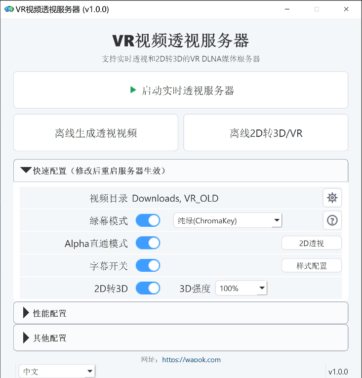
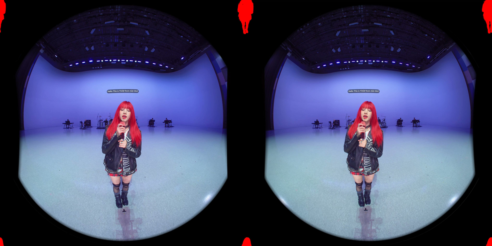
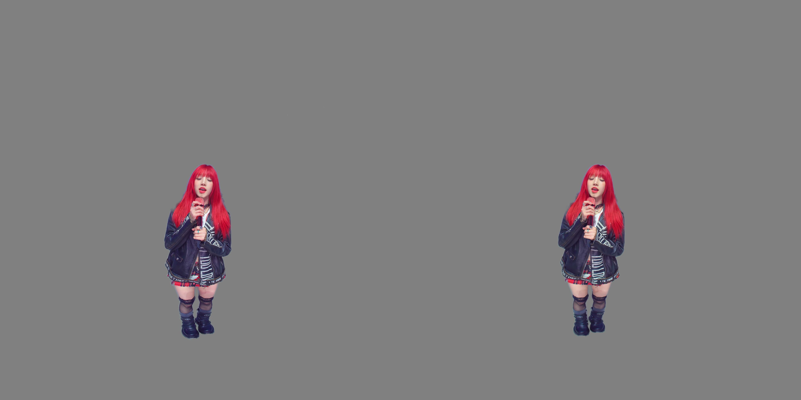

# VR视频透视服务器

中文 | [English](README.md) | [日本語](README.ja-JP.md)

项目官网：[https://wapok.com](https://wapok.com)

VR视频透视服务器 的目标是让所有VR视频都可以透视，实现混合现实(MR)。


它是以 Windows 为主要运行平台的 VR DLNA 本地媒体服务器，兼顾桌面控制和离线生成流程。它通过 DLNA/UPnP 暴露本地视频库，并支持实时透视流输出，可在绿幕合成和 Alpha 直通之间切换，同时支持实时字幕嵌入。它还包含实时/离线 2D 转 3D / VR、可选深度稳定，以及基于同名 `.si.wav` sidecar 的同声传译播放。VR视频透视服务器 主要面向 VR180 半等柱体投影（half-equirectangular）视频源。

## 项目起源

本想做一个 VR 视频透视工具。  
有人说: 你这是重复造轮子。  
我说：那个多年前的旧轮子已经太老了，该换新的了。  
七天后，新轮子诞生了。  
这是属于 AI 时代的奇迹。  

## 功能

- DLNA 发现与 视频资源目录 浏览
- 基于 GPU 抠像和 HEVC 编码的实时透视串流
- 实时透视流内嵌字幕
- 绿幕模式与 Alpha 直通模式
- 离线透视视频生成
- 基于 DA3 深度和 GPU 立体渲染的实时与离线 2D 转 3D / VR
- 2D 转 3D 可选深度稳定，包括内置时域稳定和面向离线 16:9 任务的 NVDS ONNX 稳定
- 基于同名 `.si.wav` sidecar 的同声传译播放，并在 DLNA 中显示 `[SI]` 入口
- DLNA Live 时间索引目录，可按 10 分钟分组、分钟目录和 5 秒播放点选择开始播放时间
- 支持多个本地视频根目录
- PySide6 桌面 UI，支持中文、英文、日文
- 字幕预览与字幕样式配置
- 面向 8K 级源视频的显存与吞吐优化，尽量保持硬件可承受范围内的实时 30fps 输出


|  |


## 透视视频效果图

| Alpha Passthrough | 绿幕 Passthrough |
| --- | --- |
|  |  |
|  |

## 运行要求

- Windows 10 / 11
- Python 3.12
- NVIDIA GPU，用于实时处理链路。粗略建议使用 RTX 20 系列及以上，具体型号请查询 NVIDIA 官方列表：<https://developer.nvidia.com/cuda/gpus>。推荐显存：实时服务器、RVM 离线生成和普通 DA3 2D 转 3D 建议 6 GB 以上，MatAnyone2 / SAM3 离线流程建议约 15 GB 以上。HD/Large DA3 和 NVDS 时域稳定偏离线使用，可能需要明显更多显存；NVDS 面向 16 GB 以上显卡。
- FFmpeg / FFprobe

## 快速启动

```bash
uv run python main.py
```

启动桌面 UI：

```bash
uv run python -m ui.app
```

## 端口与防火墙

软件启动实时服务器时会占用以下网络端口：

| 用途 | 协议 / 端口 | 说明 |
| --- | --- | --- |
| HTTP 媒体服务 | TCP 8200 | 提供 DLNA 设备描述、媒体目录、缩略图、原始视频和实时透视视频流。可通过环境变量 `PT_HTTP_PORT` 修改。 |
| SSDP / UPnP 发现 | UDP 1900 | 用于让 VR 播放器在局域网内发现本机 DLNA 服务器。 |
| 启动状态 | TCP 8299（仅本机） | UI 启动过程中读取 GPU warmup / 启动状态使用。默认只给本机 UI 使用，可通过 `PT_STARTUP_STATUS_PORT` 修改。 |

首次启动时，程序会尝试自动添加 Windows 防火墙入站规则：

- `PTServer HTTP Private`：允许专用网络上的 TCP 8200 入站。
- `PTServer SSDP Private`：允许专用网络上的 UDP 1900 入站。

如果 Windows 弹出 UAC / 防火墙确认窗口，请选择允许。建议只允许“专用网络”，不要暴露到公用网络。

如果误点了拒绝，或播放器无法发现服务器，可以手动添加规则。以管理员身份打开 PowerShell 或命令提示符，执行：

```powershell
netsh advfirewall firewall add rule name="PTServer HTTP Private" dir=in action=allow protocol=TCP localport=8200 profile=private edge=no enable=yes
netsh advfirewall firewall add rule name="PTServer SSDP Private" dir=in action=allow protocol=UDP localport=1900 profile=private edge=no enable=yes
```

如果你修改了 `PT_HTTP_PORT`，请把第一条命令中的 `8200` 换成实际端口。UDP 1900 是 UPnP/SSDP 标准发现端口，通常不需要修改。

也可以通过 Windows 图形界面设置：

1. 打开“Windows 安全中心” -> “防火墙和网络保护” -> “高级设置”。
2. 进入“入站规则”，新建规则。
3. 规则类型选择“端口”。
4. 分别添加 `TCP 8200` 和 `UDP 1900`。
5. 操作选择“允许连接”。
6. 配置文件建议只勾选“专用”。
7. 名称可填写 `PTServer HTTP Private` 和 `PTServer SSDP Private`。

## 支持的 VR 视频播放器

基于 Meta Quest 3 设备测试。

| 播放器 | Alpha 直通 | 灰色绿幕 | ChromaKey 绿幕 | 网站 | 备注 |
| --- | --- | --- | --- | --- | --- |
| Skybox VR Player 2.0.2 Preview | 支持 | - | 支持 | [官网](https://skybox.xyz) | [安装说明](https://forum.skybox.xyz/d/2920-skybox-quest-v202-preview-performance-improvements) |
| Moon Player | - | 支持 | 支持 | [官网](https://moonvrplayer.com) | - |
| 4XVR Video Player | 支持 | - | 支持 | [官网](https://www.4xvr.net/) | - |
| DeoVR player | 支持 | - | 支持 | [官网](https://deovr.com/) | - |
| HereSphere VR Video Player | 支持 | - | 支持 | [官网](https://heresphere.com/) | - |

## 配置说明

- `PT_VIDEO_DIR` 支持用 `|` 分隔的多个目录
- `PT_PASSTHROUGH_OUTPUT_MODE` 支持 `none`、`green`、`alpha`、`two_dvr`，也支持 `green,alpha,two_dvr` 这类逗号分隔组合；旧的 `all` 表示 green + alpha
- Alpha 模式下虚拟条目标题为 `Alpha Passthrough`
- 实时 2D 转 3D 使用 `PT_TWO_DVR_MODEL`、`PT_TWO_DVR_STRENGTH` 和相关 `PT_TWO_DVR_*` 设置；离线 2D 转 3D / VR 在桌面 UI 中提供模型、画质速度、时域稳定和“目标文件存在则跳过”等控制。
- 同名 `.si.wav` 文件会通过 progressive virtual MP4 `/media_si` 路由启用 `[SI]` DLNA 入口；主要开关是 `PT_SI_MIX_ENABLED`、`PT_SI_PROGRESSIVE_ENABLED` 和 `PT_SI_PROGRESSIVE_DLNA`。
- DLNA Live 目录会用 `[GREEN]` / `[ALPHA]` 标识透视模式，并提供本地化的 `[选择时间索引]` 目录用于选择开始时间。
- TensorRT 加速在桌面 UI 的“性能配置”中控制。请先进入 `TensorRT -> 配置` 构建缓存；首次构建可能需要数分钟。如果驱动、CUDA、TensorRT 或模型变化导致缓存缺失/过期，服务器会自动回退到 CUDA。
- UI 配置与后台运行配置分离保存

## 网盘整合包

 [【夸克网盘】](https://pan.quark.cn/s/573eb1709e18?pwd=T3bS)
 [【百度网盘】](https://pan.baidu.com/s/1uHFVFjKwlaXVxrYQ0_qcnQ?pwd=1234)


## 项目结构

```text
main.py        服务入口
config.py      运行时配置
dlna/          UPnP / DLNA 发现与目录
http_app/      FastAPI 路由
pipeline/      解码、抠像、编码、缩略图、字幕流水线
offline/       生产用离线转换入口
ui/            PySide6 桌面 UI、页面、国际化与进程控制
tools/         开发探针和诊断工具
models/        本地模型文件与清单
resources/     打包用 UI / 运行时资源
prompt/        交接记录与调研文档
```

## 引用的开源模型

VR视频透视服务器 本身不训练抠像模型，只使用下列上游项目提供的模型与模型文件。

| 模型 | 用途 | 上游链接 |
| --- | --- | --- |
| Robust Video Matting (RVM) | 实时主抠像路径，包括 `rvm_mobilenetv3_fp32.onnx` 和 `rvm_resnet50_fp32.onnx` | [GitHub](https://github.com/PeterL1n/RobustVideoMatting) |
| MatAnyone2 | 离线转换与实验流程中使用的更慢但通常更高质量的抠像路径 | [GitHub](https://github.com/pq-yang/MatAnyone2) |
| Segment Anything Model 3 (SAM 3) | 用于实验性 Alpha 工具和预处理流程的辅助分割模型 | [GitHub](https://github.com/facebookresearch/sam3) |
| Depth Anything 3 (DA3) | 实时与离线 2D 转 3D / VR 使用的单目深度模型 | [GitHub](https://github.com/ByteDance-Seed/Depth-Anything-3) |
| NVDS | 面向 16:9 源的离线 2D 转 3D 深度 / near-map 时域稳定器 | [GitHub](https://github.com/RaymondWang987/NVDS) |

## 引用的依赖

- [PySide6](https://www.qt.io/qt-for-python)
- [FastAPI](https://github.com/fastapi/fastapi)
- [Uvicorn](https://github.com/encode/uvicorn)
- [ONNX Runtime](https://github.com/microsoft/onnxruntime)
- [CuPy](https://github.com/cupy/cupy)
- [PyNvVideoCodec](https://github.com/NVIDIA/VideoProcessingFramework)
- [PyAV](https://github.com/PyAV-Org/PyAV)

## 说明

- 本项目当前主要面向本地 Windows 机器运行，而不是作为托管服务部署。
- Alpha 直通在 DLNA 中显示为虚拟条目 `VR Passthrough Server`。
- 英文版请见 [README.md](README.md)，日文版请见 [README.ja-JP.md](README.ja-JP.md)。

## 许可

许可：`AGPL-3.0-or-later`。


项目许可见仓库根目录的许可证文件。上游模型仓库各自保留自己的许可与使用条款。
